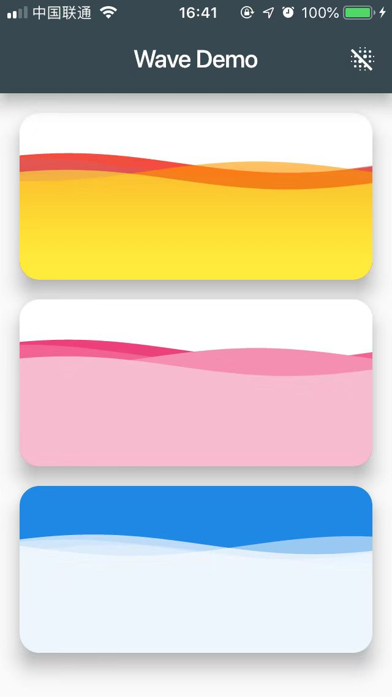
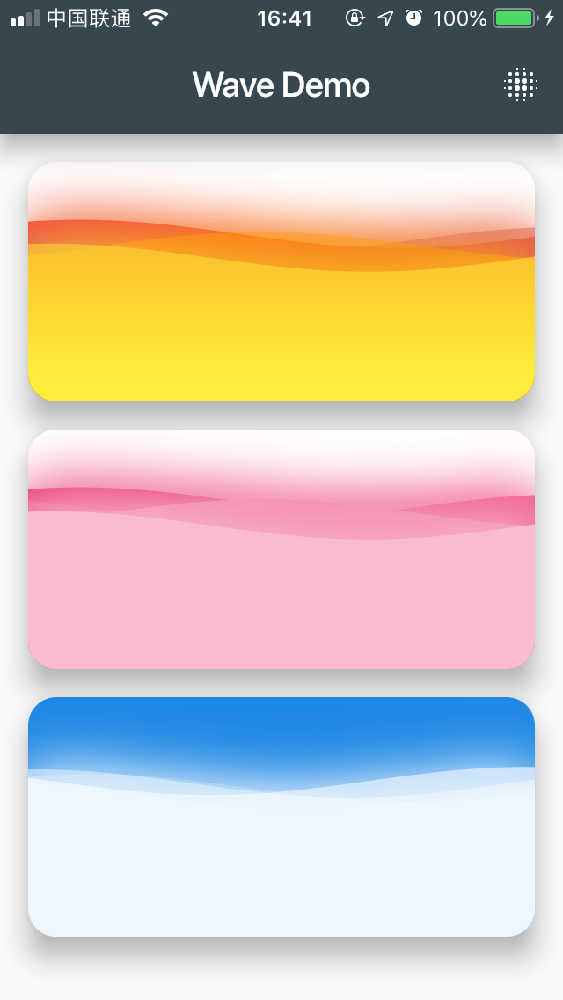
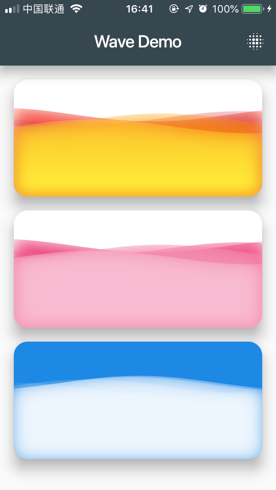
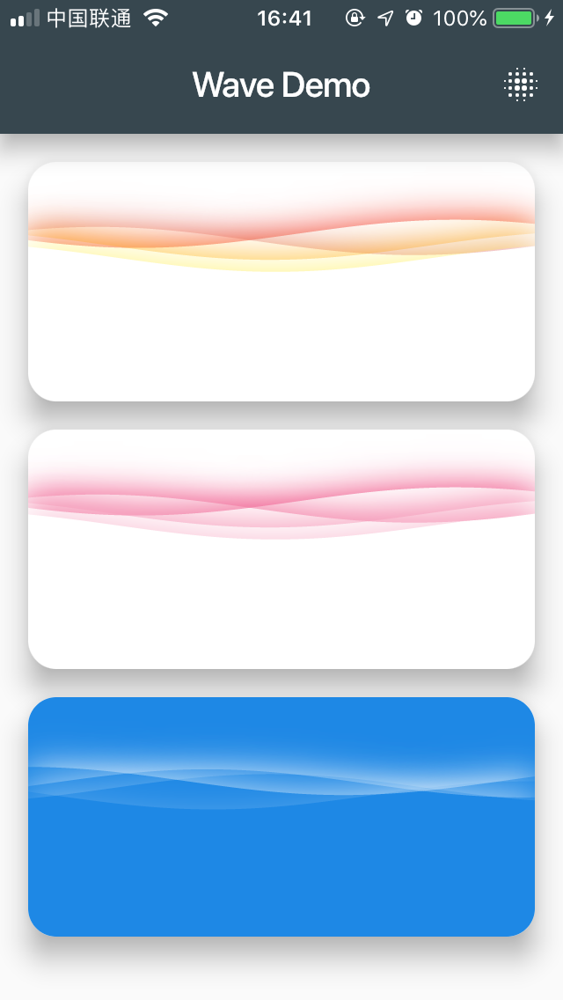
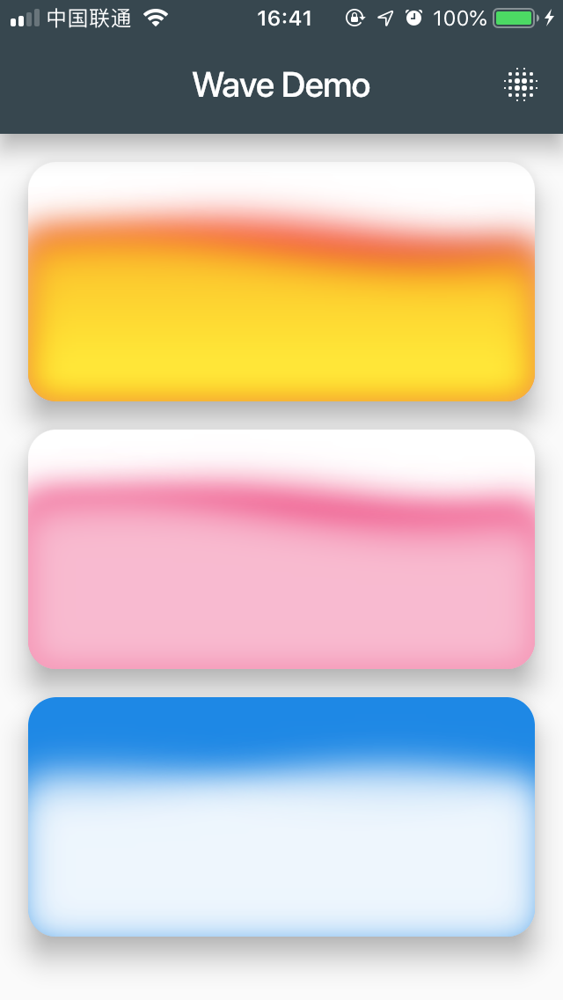

# Wave

[](https://pub.dartlang.org/packages/wave)

Widget for displaying a wave, with custom duration, size, color, alpha and so on.

## Getting Started

``` dart
    WaveWidget(
        config: CustomConfig(
            gradients: [
                [Colors.red, Color(0xEEF44336)],
                [Colors.red[800], Color(0x77E57373)],
                [Colors.orange, Color(0x66FF9800)],
                [Colors.yellow, Color(0x55FFEB3B)]
            ],
            durations: [35000, 19440, 10800, 6000],
            heightPercentages: [0.20, 0.23, 0.25, 0.30],
            blur: MaskFilter.blur(BlurStyle.solid, 10),
        ),
        colors: [
            Colors.white70,
            Colors.white54,
            Colors.white30,
            Colors.white24,
        ],
        durations: [
            32000,
            21000,
            18000,
            5000,
        ],
        waveAmplitude: 0,
        heightPercentages: [0.25, 0.26, 0.28, 0.31],
        backgroundColor: Colors.blue,
        size: Size(double.infinity, double.infinity),
    ),
```

## Preview

### Normal



### Solid Blur



### Inner Blur



### Outer Blur



### Normal Blur



### GIF

