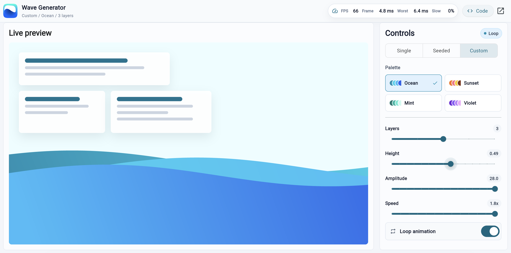

# WAVE


---

[](https://github.com/Solido/awesome-flutter#effect) 
[](https://pub.dev/packages/wave)


A Flutter package for displaying animated wave backgrounds.

## Demo

| Platform | URL |
| -: | -: |
| Web | [wave.glorylab.xyz](https://wave.glorylab.xyz "The demo page of the wave package.") |

The web demo is an interactive generator. Adjust the config mode, palette,
layer count, height, amplitude, speed, and loop behavior, then copy the
generated `WaveWidget` code into your app.



## Deployment

The web demo is built from `example/` and deployed with Cloudflare Workers Static Assets. See [docs/cloudflare-workers.md](docs/cloudflare-workers.md) for the GitHub Actions and migration setup.

## Install

```yaml
dependencies:
  wave: ^0.2.4
```

## Minimal Example

```dart
import 'package:flutter/material.dart';
import 'package:wave/wave.dart';

class WaveBackground extends StatelessWidget {
  const WaveBackground({Key? key}) : super(key: key);

  @override
  Widget build(BuildContext context) {
    return WaveWidget(
      config: SingleConfig(
        color: Color(0xFF00BBF9),
        layers: 3,
      ),
      size: Size(double.infinity, double.infinity),
    );
  }
}
```

Use `WaveWidget` anywhere a normal widget can be painted. Give it a bounded
parent, such as `SizedBox.expand`, `Positioned.fill`, or a fixed-height
container.

## Config Modes

### Single color

`SingleConfig` creates layered waves from one base color.

```dart
WaveWidget(
  config: SingleConfig(
    color: const Color(0xFF00BBF9),
    layers: 3,
  ),
  size: const Size(double.infinity, double.infinity),
)
```

### Seeded random colors

`RandomConfig` creates generated colors for each layer. Provide `seed` when
deterministic output is useful for tests, demos, or copyable examples. Omit
`seed` only when you really want a new generated palette for each config
construction.

```dart
WaveWidget(
  config: RandomConfig(
    seed: 7,
    layers: 4,
  ),
  size: const Size(double.infinity, double.infinity),
)
```

### Custom colors or gradients

`CustomConfig` is the most explicit mode. Use it when you want full control over
each layer's color or gradient, duration, and height.

```dart
WaveWidget(
  config: CustomConfig(
    gradients: const [
      [Color(0xFF00BBF9), Color(0xFF9B5DE5)],
      [Color(0xFFFEE440), Color(0xFFF15BB5)],
    ],
    durations: const [5000, 4000],
    heightPercentages: const [0.65, 0.66],
  ),
  size: const Size(double.infinity, double.infinity),
)
```

## Parameters

### WaveWidget

| Parameter | Type | Default | Description |
| --- | --- | --- | --- |
| `config` | `Config` | required | Layer colors, durations, heights, and blur. |
| `size` | `Size` | required | Paint size for the wave stack. |
| `waveAmplitude` | `double` | `20.0` | Base vertical movement of the wave path. |
| `wavePhase` | `double` | `10.0` | Initial phase offset for the animation. |
| `waveFrequency` | `double` | `1.6` | Horizontal frequency of the wave path. |
| `duration` | `int?` | `6000` | Total runtime in milliseconds when `isLoop` is false. |
| `backgroundColor` | `Color?` | `null` | Background color behind the waves. |
| `backgroundImage` | `DecorationImage?` | `null` | Background image behind the waves. |
| `isLoop` | `bool` | `true` | Whether animations repeat indefinitely. |

### Config classes

| Class | Best for | Key parameters |
| --- | --- | --- |
| `SingleConfig` | One-color layered waves | `color`, `layers`, `opacityPercentages`, `durations`, `heightPercentages` |
| `RandomConfig` | Fast generated palettes | `layers`, `seed`, `colors`, `durations`, `heightPercentages` |
| `CustomConfig` | Exact colors or gradients | `colors` or `gradients`, `durations`, `heightPercentages`, `gradientBegin`, `gradientEnd` |

## Common Errors

`CustomConfig` requires exactly one of `colors` or `gradients`.

```dart
CustomConfig(
  colors: const [Color(0xFF00BBF9)],
  gradients: const [
    [Color(0xFF00BBF9), Color(0xFF9B5DE5)],
  ],
  durations: const [5000],
  heightPercentages: const [0.65],
)
```

All per-layer lists must have the same length.

```dart
CustomConfig(
  colors: const [Color(0xFF00BBF9), Color(0xFF9B5DE5)],
  durations: const [5000],
  heightPercentages: const [0.65, 0.66],
)
```

`heightPercentages` and `opacityPercentages` values must be between `0` and
`1`, and every `duration` must be positive.
